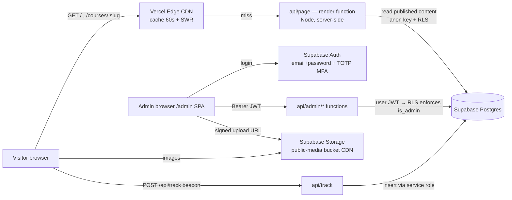
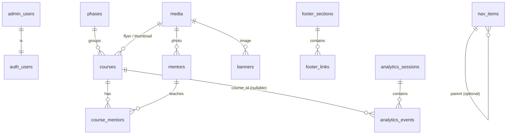

# MediVerse Dental — Backend, CMS & Admin Panel Plan

**Status:** Draft for approval. No code, packages, database tables or deployments have been created.
**Site:** https://dental.mediversebd.com
**Scope:** Turn the existing marketing website into a manageable CMS with a secure admin panel and privacy-respecting visitor analytics.
**Out of scope (by design):** student enrollment, course purchase, payments, student login, course access control.

---

## 0. Findings — what exists today

> The live site could not be fetched from the analysis environment (its network policy blocks `dental.mediversebd.com`). This analysis is based on the source in this repository (`mediverse-dental/`), which is the version we built and that you deployed. **Please confirm production matches `mediverse-dental/index.html`.**

### 0.1 Repository layout

```
sifat-inventory/                 ← repo root
├── package.json, public/, src/  ← UNRELATED app: "Photo Data Scraper / Inventory" (React + react-scripts)
└── mediverse-dental/            ← THE DENTAL WEBSITE
    ├── index.html               ← built output, deployed as-is (~3.0 MB, all images inlined as base64)
    ├── src/template.html        ← page markup, CSS and vanilla JS (711 lines)
    ├── src/build.py             ← Python build: injects courses, mentors, images, Bangla dictionary
    ├── src/i18n_bn.py           ← Bangla copy (91 page strings + 22 course descriptions)
    ├── assets/                  ← 29 source images (2 logos, 21 flyers, 6 mentor photos)
    └── README.md
```

### 0.2 Current technology

| Aspect | Today |
|---|---|
| Framework | **None.** One static HTML page with inline CSS and vanilla JavaScript |
| Build | `python3 src/build.py` creates a single self-contained `index.html` |
| Routing | Single page; navigation uses in-page anchors (`#about`, `#courses`, `#mentors`, `#stories`, `#faq`, `#contact`). No other URLs |
| Data | Hard-coded Python lists in `build.py` (`COURSES`, `MENTORS`) plus HTML text in `template.html` |
| Images | Base64-inlined into HTML, so there is no caching and a ~3 MB first load |
| Languages | English in HTML; Bangla swapped client-side via `data-i18n` keys and an embedded JSON dictionary; choice saved in `localStorage` |
| Client features | Dark/light theme, EN/BN switch, phase filter + search, count-up stats, scroll reveal, hamburger menu, floating WhatsApp |
| Deployment | No deploy config in the repo (no `vercel.json` / `netlify.toml`). An earlier screenshot showed `*.netlify.app` with a "Powered by Netlify" badge, which suggests a **manual Netlify upload**. A custom domain points to it |
| Backend / DB / analytics | None |
| Secrets in repo | None found ✅ |

### 0.3 Current content inventory (everything that must become dynamic)

| Area | Current content | Source |
|---|---|---|
| Header | Logo (white/blue variants), 5 desktop links, 6 mobile-menu links, "Enroll Now" button → mediversebd.com, theme + language toggles | `template.html` |
| Hero | Kicker, H1, Bangla tagline, lead paragraph, 2 buttons, **4 stats** (4,700+ / 25+ / 15+ / 100+) | `template.html` |
| About | Kicker, H2, intro, mission card, "25+" card, 3 feature cards, **4 phase cards** | `template.html` |
| Courses | **22 courses** across 4 phases; each has title, short description (EN+BN), flyer (21 of 22), external URL to `mediversebd.com/courses/…` (21 of 22), search keywords | `build.py` |
| Mentors | **10 mentors**: name, subject tag, credentials; 6 photos + 4 use the hijab-doctor icon (female, no photo) | `build.py` |
| Stories | 3 testimonials (anonymous: prof year + college) | `template.html` |
| FAQ | 5 Q&A | `template.html` |
| Contact/CTA | Heading, paragraph, 2 buttons, 4 social cards (Facebook, YouTube, Telegram, WhatsApp +880 1726-415926) | `template.html` |
| Footer | Brand blurb, social icons, 3 link columns (Courses / Explore / Platform), copyright, tagline | `template.html` |
| Bangla | Every visible string above has a Bangla counterpart | `i18n_bn.py` |

### 0.4 Gaps relevant to your requirements

1. **There are no course pages on this site.** "View course" links go to the main platform (`mediversebd.com/courses/...`). "Edit detailed course information" and "Most viewed course pages" need **new on-site course detail pages** (`/courses/:slug`) → see Decision D2.
2. **Images are inlined.** They must move to Supabase Storage (CDN URLs) for the media library to work. This also cuts the page from ~3 MB to roughly 60–80 KB of HTML.
3. **The repo mixes two unrelated apps.** The root React app would conflict with a Vercel project → see Decision D3.

---

## 1. Recommended architecture

**Keep the public site as plain HTML + vanilla JS** (no framework migration). Replace the Python build with a small server-side renderer on Vercel that fills the same template from Supabase data, cached at Vercel's CDN.



| Layer | Choice | Why |
|---|---|---|
| Public site | Existing `template.html`, ported from Python string replacement to a JS render function | No framework migration; same look and behaviour; SEO-friendly server HTML |
| Rendering | Vercel Function `api/page.js` + `Cache-Control: s-maxage=60, stale-while-revalidate=86400` | Admin edits appear within ~1 minute with no rebuilds. If Supabase is slow or down, the CDN keeps serving the last good page |
| Admin panel | New **Vite + React** single-page app at `/admin` (static build) | Media library, drag-reorder, forms and charts are much simpler in React. It is new code only; the public site stays vanilla |
| API | Vercel Functions (Node 20) under `/api` | Requested architecture; keeps secrets server-side |
| Database | Supabase Postgres with Row-Level Security on every table | Requested; policies are the last line of defence |
| Files | Supabase Storage, public read bucket, admin-only write | CDN delivery, reusable media library |
| Auth | Supabase Auth, sign-ups disabled, invite-only admins, TOTP MFA | No custom password handling |
| Region | Supabase **ap-south-1 (Mumbai)**, Vercel functions **bom1 (Mumbai)** | Closest to Bangladesh (lower latency) |

**Considered alternative:** build-time static generation (an admin "Publish" button triggers a Vercel rebuild). It is more resilient, but every edit waits for a 30–60 s build and course pages need a full rebuild. I don't recommend it as the primary approach, though it could be added later as a fallback snapshot.

---

## 2. Database schema

All tables live in schema `public`, with `uuid` primary keys (`gen_random_uuid()`), `created_at` / `updated_at timestamptz`, and `updated_by uuid → auth.users`. Text fields that visitors see come in **`_en` / `_bn` pairs**; an empty Bangla value falls back to English.

### 2.1 Entity relationships



### 2.2 Tables — access & settings

| Table | Key columns | Notes |
|---|---|---|
| `admin_users` | `user_id` PK → `auth.users`, `role` enum(`owner`,`editor`), `display_name`, `created_at` | Allowlist. Only users in this table can use the admin panel. `owner` also manages users and settings |
| `site_settings` | `key` text PK, `value` jsonb | Singleton settings: site name, logo media ids (dark/light), WhatsApp number, contact email/phone/address, copyright text (EN/BN), default SEO title/description/OG image, analytics on/off, data-retention days |
| `audit_log` | `id` bigserial, `actor` uuid, `action` text, `entity` text, `entity_id` uuid, `diff` jsonb, `at` | Every admin write; read-only in the UI |

### 2.3 Tables — homepage content

| Table | Key columns | Notes |
|---|---|---|
| `page_sections` | `id`, `page` text (`home`), `key` text (`hero`,`about`,`courses`,`mentors`,`stories`,`faq`,`contact`), `is_visible` bool, `sort_order` int, `content` jsonb | Headings, paragraphs and button text/URL per section. `content` = `{ "en": {...}, "bn": {...}, "buttons": [{label_en,label_bn,url,style,new_tab}], "image_media_id": … }`. Each section key has a documented JSON shape validated by the API (zod). Unique (`page`,`key`) |
| `stats` | `id`, `value` int, `suffix` text, `label_en`, `label_bn`, `is_visible`, `sort_order` | Hero counters (4,700+ etc.) |
| `features` | `id`, `icon` text, `title_en/bn`, `body_en/bn`, `is_visible`, `sort_order` | About section feature cards |
| `faqs` | `id`, `question_en/bn`, `answer_en/bn` (limited Markdown), `is_visible`, `sort_order` | |
| `testimonials` | `id`, `quote_en/bn`, `attribution_en/bn`, `is_visible`, `sort_order` | Attribution stays anonymous ("3rd Prof student, DDC") |
| `banners` | `id`, `title`, `image_media_id` → media, `link_url`, `placement` enum(`home_top`,`home_mid`,`course_page`), `starts_at`, `ends_at`, `is_active`, `sort_order` | Optional scheduled banners |

### 2.4 Tables — courses & mentors

| Table | Key columns | Notes |
|---|---|---|
| `phases` | `id`, `code` smallint unique (1–4), `name_en/bn`, `summary_en/bn`, `sort_order` | Drives filter chips and About phase cards |
| `courses` | `id`, `slug` unique, `title_en/bn`, `short_desc_en/bn`, `details_en/bn` (Markdown), `info` jsonb (`features[]`, `total_classes`, `access_period`, `book_refs[]`, `exam_focus`), `phase_id` → phases, `flyer_media_id` → media, `thumbnail_media_id` → media, `external_url` (link to the course on mediversebd.com), `cta_label_en/bn`, `search_keywords` text[], `status` enum(`active`,`upcoming`,`hidden`), `sort_order` int, `archived_at` timestamptz null | `hidden` = not shown publicly; `archived_at` = soft delete (restorable). Index (`status`,`sort_order`) |
| `mentors` | `id`, `slug` unique, `name`, `designation_en/bn` (the subject tag), `credentials` (e.g. "MBBS (DMC), BCS…"), `bio_en/bn`, `institution`, `session`, `photo_media_id` → media null, `avatar_style` enum(`photo`,`hijab_icon`,`initials`), `links` jsonb `[{type,url}]`, `status` enum(`active`,`hidden`), `sort_order`, `archived_at` | `hijab_icon` reproduces today's icon for female mentors without a photo |
| `course_mentors` | PK (`course_id`,`mentor_id`), `role` text (e.g. `lead`), `sort_order` | Many-to-many "assign mentors to courses" |

### 2.5 Tables — navigation & footer

| Table | Key columns | Notes |
|---|---|---|
| `nav_items` | `id`, `location` enum(`header`,`mobile`), `label_en/bn`, `url`, `is_external`, `open_new_tab`, `is_visible`, `sort_order`, `parent_id` null, `style` enum(`link`,`button`) | Header CTA ("Enroll Now") is a `button` item |
| `footer_sections` | `id`, `title_en/bn`, `type` enum(`links`,`text`,`contact`,`social`), `body_en/bn`, `is_visible`, `sort_order` | Columns "Courses / Explore / Platform" and the brand blurb |
| `footer_links` | `id`, `section_id` → footer_sections (cascade), `label_en/bn`, `url`, `is_external`, `is_visible`, `sort_order` | |
| `social_links` | `id`, `platform` enum(`facebook`,`youtube`,`telegram`,`whatsapp`,`instagram`,`linkedin`,`tiktok`,`x`,`website`), `url`, `label_en/bn`, `subtitle_en/bn`, `show_in_header`, `show_in_footer`, `show_in_contact`, `is_visible`, `sort_order` | Shared by the mobile menu, contact cards and footer icons |

Contact info and copyright live in `site_settings` (single values, not lists).

### 2.6 Tables — media

| Table | Key columns | Notes |
|---|---|---|
| `media` | `id`, `bucket`, `path` unique, `public_url`, `kind` enum(`image`,`flyer`,`mentor_photo`,`banner`,`logo`,`thumbnail`), `mime`, `size_bytes`, `width`, `height`, `alt_en/bn`, `sha256` (de-duplication), `uploaded_by`, `created_at` | One row per stored object |
| view `media_usage` | `media_id`, `used_by` (`courses.flyer`, `mentors.photo`, `page_sections.content`, `site_settings.logo`, …), `ref_count` | Built from FKs plus a jsonb scan of `page_sections` / `site_settings`. Powers "unused" filter and safe delete |

### 2.7 Tables — analytics (see §6)

| Table | Key columns |
|---|---|
| `analytics_events` | `id` bigserial, `occurred_at`, `type` enum(`pageview`,`course_view`,`outbound_click`,`engagement`), `visitor_id` uuid, `session_id` uuid, `path`, `page_type` (`home`,`course`,`other`), `course_id` null, `target_url` null (outbound), `referrer_domain`, `utm_source`, `utm_medium`, `utm_campaign`, `device_type` (`mobile`,`tablet`,`desktop`), `browser`, `os`, `country` char(2) null, `lang` (`en`,`bn`), `engaged_ms` int |
| `analytics_sessions` | `session_id` PK, `visitor_id`, `is_new_visitor` bool, `started_at`, `last_seen_at`, `engaged_ms`, `pageviews` int, `entry_path`, `exit_path`, `referrer_domain`, `utm_source`, `device_type`, `browser`, `os`, `country` |
| `analytics_daily` | PK `day` date — `visitors`, `new_visitors`, `returning_visitors`, `sessions`, `pageviews`, `avg_engaged_ms` |
| `analytics_daily_pages` | PK (`day`,`path`) — `views`, `visitors`; plus `course_id` for course pages |
| `analytics_daily_dims` | PK (`day`,`dimension`,`value`) — `dimension` ∈ `device`,`browser`,`os`,`country`,`source`; `visitors`, `pageviews` |

Indexes on `analytics_events(occurred_at)`, `(course_id, occurred_at)` and `(session_id)`. Rollups are computed nightly by **pg_cron** (today's numbers come live from the raw tables). Raw events are kept for **13 months**, rollups indefinitely.

---

## 3. API endpoints (Vercel Functions)

All admin endpoints live in a single catch-all function, `api/admin/[...route].js`, with an internal router. This keeps the function count low and lets auth checks live in one place.

### 3.1 Public

| Method | Path | Purpose | Caching |
|---|---|---|---|
| GET | `/` | Rendered homepage (rewrite → `api/page?view=home`) | `s-maxage=60, stale-while-revalidate=86400` |
| GET | `/courses/:slug` | Course detail page (**new**, see D2); 404 for hidden/archived | same |
| GET | `/sitemap.xml`, `/robots.txt` | SEO; `/admin` disallowed | 1 h |
| POST | `/api/track` | Analytics beacon → `204` | `no-store` |

### 3.2 Admin — every request needs `Authorization: Bearer <Supabase access token>` + membership in `admin_users`

| Area | Endpoints |
|---|---|
| Session | `GET /api/admin/me` (profile + role) |
| Homepage | `GET /api/admin/sections` · `PUT /api/admin/sections/:key` (content) · `PATCH /api/admin/sections/:key/visibility` · `POST /api/admin/sections/reorder` |
| Homepage lists | CRUD + `POST …/reorder` for `/api/admin/stats`, `/features`, `/faqs`, `/testimonials`, `/banners` |
| Courses | `GET /api/admin/courses?status=&phase=&q=&archived=` · `POST /api/admin/courses` · `GET/PUT /api/admin/courses/:id` · `POST /api/admin/courses/:id/archive` · `POST /api/admin/courses/:id/restore` · `DELETE /api/admin/courses/:id` (owner only, archived only) · `POST /api/admin/courses/reorder` · `PUT /api/admin/courses/:id/mentors` |
| Mentors | `GET/POST /api/admin/mentors` · `GET/PUT /api/admin/mentors/:id` · `POST …/:id/archive` · `POST …/:id/restore` · `POST /api/admin/mentors/reorder` |
| Phases | `GET /api/admin/phases` · `PUT /api/admin/phases/:id` |
| Header | `GET/POST /api/admin/nav-items` · `PUT/DELETE /api/admin/nav-items/:id` · `POST /api/admin/nav-items/reorder` |
| Footer | `GET/POST /api/admin/footer/sections` · `PUT/DELETE …/:id` · `GET/POST /api/admin/footer/links` · `PUT/DELETE …/:id` · reorder for both · `GET/POST/PUT/DELETE /api/admin/social-links` |
| Media | `GET /api/admin/media?kind=&q=&unused=true` · `POST /api/admin/media/upload-url` (validates type/size, returns signed upload URL + path) · `POST /api/admin/media` (register after upload: dims, hash, alt) · `PATCH /api/admin/media/:id` (alt text) · `GET /api/admin/media/:id/usage` · `DELETE /api/admin/media/:id` (**409 if in use**) |
| Analytics | `GET /api/admin/analytics/overview?from=&to=` · `GET …/timeseries?metric=visitors|pageviews|sessions&interval=day|week|month` · `GET …/pages` · `GET …/courses` · `GET …/breakdown?dim=device|browser|os|country|source` · `GET …/sessions?limit=` (anonymous page paths per session) |
| Settings | `GET/PUT /api/admin/settings` · `GET /api/admin/audit-log` |
| Users (owner) | `GET /api/admin/users` · `POST /api/admin/users/invite` (Supabase admin invite, server-side) · `PATCH /api/admin/users/:id` (role) · `DELETE /api/admin/users/:id` |

Conventions: JSON in/out; all inputs validated with **zod**; errors as `{ error: { code, message } }`; every write goes to `audit_log`; list endpoints are paginated.

---

## 4. Authentication & authorization

| Item | Design |
|---|---|
| Identity | Supabase Auth, email + password. **Public sign-ups disabled.** Admins are added only by **invite** from the owner (or from the Supabase dashboard for the first owner) |
| MFA | Supabase TOTP MFA — **required for `owner`**, recommended for editors. API rejects owner actions unless the session is AAL2 |
| Admin check | `admin_users` allowlist + SQL function `is_admin()` / `is_owner()` (`security definer`, checks `auth.uid()`) |
| API enforcement | Each admin request: verify the JWT with Supabase → look up role → create a Supabase client **with the user's JWT** so RLS applies again (defence in depth). The service-role key is **not** used for admin CRUD |
| Database enforcement (RLS) | Content tables: `anon` may `SELECT` only visible/active, non-archived rows needed to render the site. `INSERT/UPDATE/DELETE` only when `is_admin()`. `admin_users`, `site_settings` writes and user management: `is_owner()`. Analytics tables: **no `anon` access at all**; admins read only through `security definer` aggregate RPCs |
| Sessions | Access JWT 1 h, refresh rotation on; tokens kept in memory/sessionStorage by supabase-js; logout revokes refresh token |
| Brute force | Supabase Auth built-in rate limits + CAPTCHA (Cloudflare Turnstile, supported natively by Supabase) on the login form |
| Roles | `owner`: everything incl. users, settings, hard delete. `editor`: content, courses, mentors, header/footer, media; no users/settings/hard delete |

---

## 5. Admin panel structure (`/admin`, Vite + React SPA)

Libraries: `react`, `react-router`, `@supabase/supabase-js`, `@tanstack/react-query`, `zod`, `@dnd-kit` (drag reorder), `chart.js` (charts). The admin build is excluded from search (`noindex`) and does **not** load the visitor tracker.

| Section | What the admin can do |
|---|---|
| **Login** | Email + password, TOTP code, CAPTCHA, "forgot password" |
| **Dashboard** | Cards: Total visitors · Today's visitors · Monthly visitors · Total page views · Most visited page · Most viewed course. Charts: Visitors over time, Page views over time, Course page views (bar), Device breakdown (donut). Date range picker (7d / 30d / 90d / custom) |
| **Homepage** | One panel per section (Hero, About, Courses intro, Mentors intro, Stories, FAQ, Contact). EN and BN fields side by side, button text + URL, image picker, **visibility toggle**, section order. Sub-tabs for Stats, Features, FAQs, Testimonials, Banners (add/edit/reorder/hide) |
| **Courses** | Table with flyer thumbnail, title, phase, status badge (Active / Upcoming / Hidden), mentors. Drag to reorder, filters, search. Edit form: titles, short + detailed description (EN/BN, Markdown with preview), course info (features, classes, access period), flyer + thumbnail picker (from media library or upload), external enroll URL, keywords, status, mentor assignment. Archive / restore; owner-only permanent delete |
| **Mentors** | Card grid with drag reorder. Edit: name, designation (EN/BN), credentials, bio (EN/BN), institution, session, photo (or hijab icon / initials), social/profile links, courses taught. Archive / restore |
| **Header** | Desktop and mobile menu lists: add, edit label (EN/BN) and URL, internal anchor vs external link, open in new tab, show/hide, drag order, set as button |
| **Footer** | Brand text, link columns (add/edit/hide/reorder sections and links), social links, contact info, copyright text (EN/BN), show/hide each footer section |
| **Media Library** | Grid with filters (kind, unused), search, upload (drag-drop, multi-file), image details (size, dimensions, alt text EN/BN, "used in…"), copy URL, replace, delete (blocked while in use; "Delete all unused" with confirmation) |
| **Analytics** | Full reports: visitors / unique / new vs returning / sessions / page views (daily, weekly, monthly), top pages, top course pages, outbound "View course" clicks, device, browser, OS, country, traffic source & UTM, average engaged time, recent anonymous session paths. CSV export |
| **Settings** | Site info, logos, WhatsApp/contact, SEO defaults & social preview image, analytics on/off + retention, admin users & roles (owner), audit log, password & MFA |

UX safeguards: unsaved-changes warning, "Preview" (opens the public page with the new data), optimistic UI with rollback, and a note that the live site refreshes within ~1 minute.

---

## 6. Analytics architecture (privacy-first)

### 6.1 Principles

- **Visitors are anonymous website visitors**, never labelled "students". The UI uses "visitors", "sessions" and "page views" only.
- **No PII is collected:** no names, emails, phone numbers, IP addresses or full user-agent strings are stored. No third-party trackers or cookies.
- Honours **Do Not Track / Global Privacy Control**: if set, the tracker sends nothing.
- A short "We count anonymous visits to improve the site" line is added to the footer, linked to a privacy note.

### 6.2 What is collected and how

| Data | Method |
|---|---|
| Visitor ID | Random UUID created in the browser and stored in `localStorage` (`mvd_vid`). It identifies only a browser, not a person. Enables unique/new/returning counts. Clearing storage = new visitor |
| Session ID | Random UUID in `sessionStorage`; a new session starts after 30 min of inactivity |
| New vs returning | `is_new` = visitor ID was created during this page load |
| Page / course | `path`; course pages send `course_id` (by slug). "View course" clicks are sent as `outbound_click` with the target URL |
| Device / browser / OS | User-agent parsed **server-side** in `/api/track` (e.g. `ua-parser-js`) into coarse categories; raw UA discarded |
| Country | Vercel header `x-vercel-ip-country` (2-letter code). The IP itself is **never stored** |
| Source | `document.referrer` reduced to **domain only** (e.g. `facebook.com`) + `utm_*` query params; "direct" if none |
| Session duration (approx.) | Engaged time: visible-tab time is accumulated and sent on `visibilitychange`/`pagehide` via `navigator.sendBeacon` as an `engagement` event |
| Bots | Server-side bot user-agent filter; events require JS (most crawlers excluded); admin browsers can set an "exclude me" flag |

### 6.3 Pipeline

1. A tiny tracker (~2 KB, inline in the page) sends a `pageview` on load and an `engagement` beacon on leave.
2. `POST /api/track` validates the payload (zod, size ≤ 2 KB, allowed paths only), checks the `Origin`, parses UA/geo, drops bots, then **inserts the event and upserts the session** using the service-role key (server only).
3. Abuse protection: Vercel Firewall rate-limit rule on `/api/track` plus a per-session event cap.
4. **pg_cron** (nightly, 00:15 Asia/Dhaka) fills `analytics_daily*` rollups and deletes raw events older than the retention period.
5. The admin dashboard calls aggregate RPCs (range queries on rollups + today's live data). Weekly/monthly are computed from daily (distinct visitors per week/month come from raw events within retention).

### 6.4 Metric definitions shown in the UI

| Metric | Definition |
|---|---|
| Unique visitors | Distinct visitor IDs in the range (approximate: same person on two devices = 2) |
| Total visitors | Sum of daily unique visitors over the range |
| Page views | Count of `pageview` events |
| Sessions | Distinct session IDs |
| New / returning | Visitors whose first-seen date is / isn't inside the range |
| Avg. session duration | Mean engaged time per session (approximate) |

---

## 7. Media storage architecture

| Item | Design |
|---|---|
| Bucket | `public-media` (public read, served via Supabase CDN) |
| Paths | `flyers/{uuid}.webp`, `mentors/{uuid}.webp`, `banners/{uuid}.webp`, `logos/{uuid}.png`, `images/{uuid}.webp`, plus `…-thumb.webp` variants |
| Upload flow | Admin picks file → **resized in the browser** (max 1600 px long side + 600 px thumbnail, WebP q≈82) → `POST /api/admin/media/upload-url` → direct upload with signed URL → `POST /api/admin/media` registers metadata |
| Allowed types | JPEG, PNG, WebP, AVIF. **SVG blocked** (it can carry script); max 5 MB before resize |
| Storage RLS | `storage.objects`: public `SELECT` on `public-media`; `INSERT/UPDATE/DELETE` only when `is_admin()` |
| De-duplication | SHA-256 stored; re-uploading an identical file reuses the existing record |
| Safe delete | `media_usage` must be 0; otherwise the UI lists where it's used |
| Migration | One-time seed script uploads the 29 files in `assets/` and links them to seeded courses, mentors and logos |

---

## 8. Security considerations

1. **Secrets live only in Vercel server env vars.** `SUPABASE_SERVICE_ROLE_KEY` is used only by `/api/track`, user invites and cron-like jobs, and is never sent to the browser or prefixed `VITE_`. The anon key is public by design and protected by RLS.
2. **RLS enabled on every table** (deny by default), with policies written and tested in SQL migrations. An automated test checks that `anon` cannot read analytics or write anything.
3. **Output escaping:** the render function HTML-escapes every DB string. Markdown fields are rendered with a safe subset and sanitized (no raw HTML).
4. **URL validation:** only `https:`, `http:`, `mailto:`, `tel:`, `https://wa.me/…` and in-page `#anchors` are allowed. `javascript:` and `data:` are rejected.
5. **Headers:** a strict `Content-Security-Policy` (site and admin separately), `X-Frame-Options: DENY` on `/admin`, `Referrer-Policy: strict-origin-when-cross-origin`, `Permissions-Policy`, HSTS.
6. **Admin hardening:** invite-only, MFA for owner, Turnstile on login, `noindex`, audit log of every change, and a least-privilege `editor` role.
7. **CORS:** `/api/admin/*` accepts only the site origin; `/api/track` checks `Origin`.
8. **Backups:** the Supabase Free plan has no point-in-time recovery, so a weekly `pg_dump` (GitHub Action) to private storage is added. On Supabase Pro, daily backups are included.
9. **Dependencies:** a minimal set, lockfile committed, Dependabot alerts on.
10. **Privacy:** no PII is collected, a privacy note is published, and data retention is configurable.

---

## 9. Environment variables

| Variable | Where | Exposed to browser? | Purpose |
|---|---|---|---|
| `SUPABASE_URL` | Vercel (server) | No | Server Supabase client |
| `SUPABASE_ANON_KEY` | Vercel (server) | No (server copy) | Render function + JWT-scoped admin client |
| `SUPABASE_SERVICE_ROLE_KEY` | Vercel (server) | **Never** | Analytics ingest, admin invites |
| `VITE_SUPABASE_URL` | Admin build | Yes (safe) | Admin login |
| `VITE_SUPABASE_ANON_KEY` | Admin build | Yes (safe, RLS-protected) | Admin login/session |
| `VITE_TURNSTILE_SITE_KEY` | Admin build | Yes (safe) | Login CAPTCHA widget |
| `SITE_URL` | Vercel (server) | No | Canonical URLs, CORS origin, sitemap |
| `ANALYTICS_ENABLED` | Vercel (server) | No | Kill switch for `/api/track` |

The Turnstile secret is configured inside Supabase Auth settings, not in this app. A `.env.example` with names only is committed; real values are never committed (`.env*` will be added to `.gitignore`, which currently only ignores `*.zip` and `__pycache__/`).

---

## 10. Proposed project structure (new files; existing files untouched until cutover)

```
mediverse-dental/
├── api/
│   ├── page.js                 # renders / and /courses/:slug from template + DB
│   ├── track.js                # analytics ingest
│   └── admin/[...route].js     # all admin endpoints (router + auth middleware)
├── lib/                        # server-only: supabase clients, auth guard, render, escape, i18n, ua parsing, zod schemas
├── site/
│   ├── template.html           # ported from src/template.html (placeholders → render function)
│   ├── course.html             # new course detail template, same design system
│   └── tracker.js              # inlined at render time
├── admin/                      # Vite + React SPA (builds to /admin)
├── supabase/
│   ├── migrations/*.sql        # schema, RLS, functions, pg_cron jobs
│   └── seed/seed.mjs           # imports current courses, mentors, copy, Bangla, assets
├── vercel.json                 # rewrites, headers, regions (bom1)
├── package.json
└── legacy/                     # current src/build.py, i18n_bn.py, index.html kept as fallback until cutover
```

---

## 11. Deployment plan

| Phase | Work | Output / check |
|---|---|---|
| **0. Decisions** | Approve this plan + the decisions in §12 | — |
| **1. Supabase** | Create project (Mumbai), disable sign-ups, enable MFA + Turnstile, create bucket. Apply migrations from the repo (schema, RLS, functions, pg_cron) | RLS test script passes |
| **2. Seed** | Run seed script: 22 courses, 10 mentors, 4 phases, all homepage copy EN+BN, nav, footer, socials, 29 images | Admin row for you as `owner` |
| **3. Public renderer** | Port template to `api/page.js`; build course detail pages | **Visual regression:** Playwright screenshots of the new render vs. today's `index.html` (desktop + mobile, EN + BN, dark + light) must match |
| **4. Admin panel** | Build SPA sections in the order: Courses → Mentors → Media → Homepage → Header/Footer → Settings → Dashboard/Analytics | Manual test checklist per section |
| **5. Analytics** | Tracker + `/api/track` + rollups + dashboard | Synthetic traffic test; verify no PII in tables |
| **6. Staging** | Deploy to a Vercel **preview URL** (not your domain) for your review | Your sign-off |
| **7. Cutover** | Add `dental.mediversebd.com` to Vercel, switch DNS (CNAME → `cname.vercel-dns.com`), keep the Netlify site untouched for 2 weeks as instant rollback | Site live on Vercel, SSL OK |
| **8. Hand-over** | Short admin guide (how to add a course/mentor, upload media, read analytics) | `ADMIN_GUIDE.md` |

---

## 12. Decisions needed from you before building

| # | Question | My recommendation |
|---|---|---|
| **D1** | **Hosting move.** The site appears to be on **Netlify** today; the requested backend uses **Vercel**. Vercel's free Hobby plan is for **non-commercial** use only, so a business site needs **Vercel Pro (~$20/month)**. Alternative: stay on Netlify and use **Netlify Functions** (same design, Netlify free tier allows commercial use) | Vercel Pro if budget allows (Mumbai region, built-in geo/firewall); otherwise Netlify Functions — the plan works either way with small changes |
| **D2** | **Course detail pages.** Add on-site pages at `/courses/:slug` (details, mentors, flyer, "Enroll on mediversebd.com" button)? Needed for "edit detailed course info" and "most viewed course pages" | **Yes.** Cards open the on-site page; enrolment still happens on mediversebd.com |
| **D3** | **Repository.** The root of this repo is an unrelated inventory app | Move the dental site into its **own repository** (e.g. `mediverse-dental`), or set the Vercel project root to `mediverse-dental/` |
| **D4** | **Admin users.** Just you, or more people? | You as `owner`; add `editor` accounts as needed |
| **D5** | **Returning-visitor tracking** uses an anonymous random ID in `localStorage` (no cookies, no PII) plus a short privacy note. OK? | Yes; without it, new vs returning cannot be measured |
| **D6** | **Supabase plan.** Free tier: 500 MB DB, 1 GB storage, no backups/PITR. Pro: $25/month with daily backups | Start on Free with the weekly backup job; move to Pro if traffic grows |
| **D7** | **Bangla content.** Every visitor-facing field gets EN + BN in the admin (BN optional, falls back to EN) | Yes, keeps the current language switch working |
| **D8** | **Confirm production** = this repo's `mediverse-dental/index.html` (the live site couldn't be fetched from here) | — |

---

*Once approved, implementation proceeds phase by phase, with a review checkpoint after Phase 3 (pixel-matching public site) and Phase 6 (staging).*
